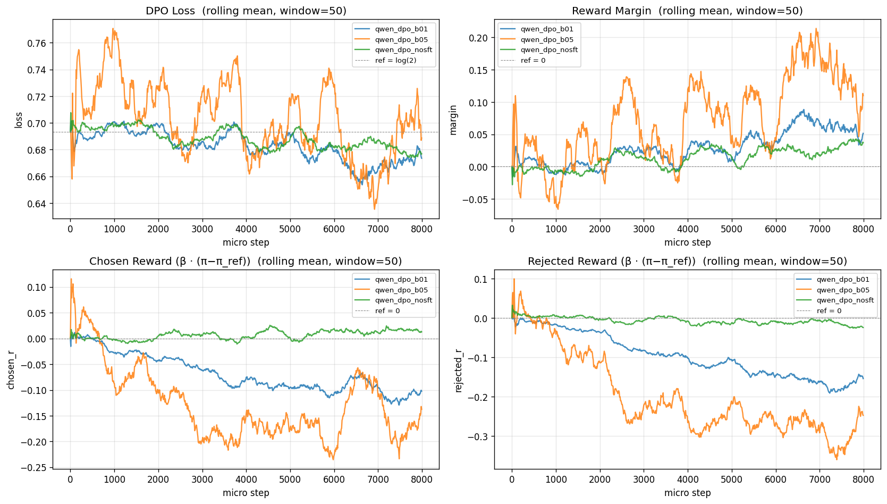

# dpo-qwen0.5
DPO training of Qwen2.5-0.5B on binarized UltraFeedback, implemented from scratch. Includes ablations on the KL strength β ∈ {0.1,0.5} and on the base vs instruction-tuned starting checkpoint.

**Headline:** the baseline (β=0.1, model-variant=-Instruct) lifts UltraFeedback pref test accuracy from 45.6% to 58.2% in 1000 optimizer steps. The β=0.5 ablation reaches 57.4%. The (β=0.1, model-variant=-Base) ablation reaches 56.4%. 

## Setup
| | |
|---|---|
|Model | Qwen/Qwen2.5-0.5B (-Instruct and Base)|
|Dataset | HuggingFaceH4/ultrafeedback_binarized (train_pref split for RL, test_pref split for eval) |
|Algorithm | DPO from scratch ("src/dpo.py", ~290 LoC) |
|Hardware | Colab Pro A100 80GB |
|Steps | 1000 optimizer (8k micro) |
|Optimizer | AdamW, LR 5e-7 |
|Effective batch | per device 4 x grad-accum 8 = 32 prompts/update |
|KL strength β | **0.1** (baseline) and **0.5** (ablation) |
|Seed | 42 (single seed per run) |

## Repository Layout
```
src/dpo.py        — loss + train loop (~290 LoC)
src/data.py       — UltraFeedback prep, prompt/response masking
configs/*.yaml    — one per run, documentation-only (CLI is source of truth)
notebooks/01..03  — one Colab notebook per run (A100)
notebooks/04      — cross-run summary + figure
results/<run>/    — config.json, metrics.jsonl, eval_test_prefs.json
```

## Algorithm 
DPO replaces RLHF's separate reward model + PPO loop with a single supervised objective on preference pairs (prompt, chosen, rejected):
```
L = - E[log σ( β · ( (logπ(y_w|x) - logπ_ref(y_w|x))
                      - (logπ(y_l|x) - logπ_ref(y_l|x)) ) ) ]
```
The frozen reference policy π_ref is a copy of the starting checkpoint. β controls how far the policy is allowed to drift from π_ref - small β = looser KL anchor, large β = stronger anchor. At step 0, policy == ref, so the loss is exactly log(2) ~ 0.693 - used as an init sanity check.

## Training dynamics


Rolling mean over a 50-microbatch window across all three runs: 
- **Loss** starts at log(2) ~ 0.69 for all three runs (sanity: policy == ref at step 0) and trends down.
- **Reward margin** grows for all three - DPO is doing what it should
- **Chosen / rejected reward** show the KL anchor effect but you have to read past the β multiplier. β=0.5 (orange) has more-negative **displayed** rewards because reward = β * (logπ - logπ_ref) amplifies the difference. Dividing β back out shows β=0.1 actually drift ~4x further from the reference in log-prob space (chosen: -1.32 vs -0.31) - as expected from the weaker KL anchor.
- The **no-SFT** run (green) shows almost no drift from its reference - chosen and rejected rewards both hug zero throughout training. With the same β=0.1 as the blue run, the base model reaches comparable pref_acc (56.4% vs 58.2%) with ~10x smaller log-prob shifts. The base distribution over chosen vs rejected appears flatter to begin with, so small logit nudges are enough to flip preferences; the instruction-tunes policy has a stronger prior that the DPO signal has to overwrite. 
- **Margin convergence despite different absolute drift.** b01 and no-SFT end up at comparable margins and pref_accs, even though their chosen/rejected rewards live on different scales. This is exactly what DPO is supposed to do - the loss depends only on (chosen_r - rejected_r), not on absolute log-prob levels. b01 opens its margin by pushing both rewards down (rejected further) while no-SFT opens its margins by nudging rejected slightly more negative while chosen stays near zero. Two very different policies, equivalent under the DPO objective.

## Implementation notes
- Init check. First-batch loss asserted within 0.05 of log(2) - catches any policy/ref mismatch (wrong dtype, wrong checkpoint, accidental weight tying) before wasting an A100-hour.
- Loss sanity tests (python -m src.dpo --sanity): zero-grad when policy == ref, loss < log(2) when policy already prefers chosen, correct gradient signs on chosen vs. rejected log-probs.
- Response-only masking. Log-probs are summed only over response tokens, not over the prompt — the prompt is identical for chosen and rejected and would cancel, but masking it avoids wasted compute and noise.
- bf16 throughout, flash-attention-2 auto-detected with sdpa fallback.
- Policy and reference are loaded as two separate AutoModelForCausalLM instances; reference is eval() + requires_grad_(False).

## Evaluation
- pref_acc = fraction of held-out test pairs where the policy assigns a higher summed log-probability to the chosen response than to the rejected response.
- margin = mean (chosen_reward - rejected_reward) on test, where reward = β · (logπ − logπ_ref).
- chosen_r / rejected_r = mean of each reward term separately. Evaluated on ultrafeedback_binarized test_prefs (~1820 pairs).

## Evaluation summary
| Run | pref_acc | margin | chosen_r | rejected_r | n_pairs |
|---|---|---|---|---|---|
| base_base | 0.447 | +0.000 | +0.000 | +0.000 | 1820 |
| base_instruct | 0.456 | +0.000 | +0.000 | +0.000 | 1813 |
| qwen_dpo_b01 | 0.582 | +0.042 | -0.132 | -0.175 | 1813 |
| qwen_dpo_b05 | 0.574 | +0.109 | -0.155 | -0.264 | 1813 |
| qwen_dpo_nosft | 0.564 | +0.020 | +0.008 | -0.012 | 1820 |

Reward columns are zero by construction for the un-trained baselines since policy == reference.

## Takeaways
- DPO works at 0.5B scale on a 1k-optimizer-step budget: **+12.6pp pref_acc** over the SFT baseline (45.6-> 58.2).
- **β=0.1 narrowly beat β=0.5 by 0.8pp** here. β=0.5 produced a larger train-time reward margin but lower test pref_acc - a hint of over-fitting the preference signal at the cost of generelization.
- **Starting from -Base (no-SFT) only loses ~1.8pp** vs starting from -Instruct. DPO can lift a raw base model meaningfully without an SFT stage on this dataset and budget.

## How to reproduce 
```bash
pip install -r requirements.txt
python -m src.dpo --sanity                          # loss unit tests
python -u -m src.dpo --beta 0.1 --lr 5e-7 \
    --batch-size 4 --grad-accum 8 --max-steps 8000 \
    --run-name qwen_dpo_b01
```
Eval is in notebooks/04_summary.ipynb (loads metrics.jsonl + eval_test_prefs.json from each results/run/).
